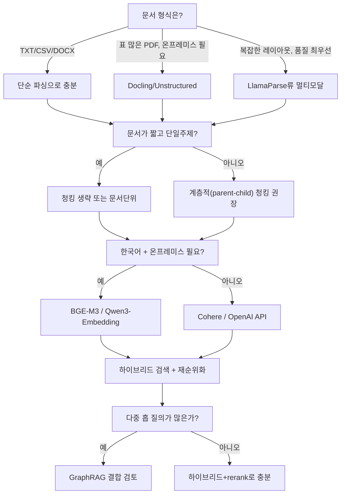

# RAG 포탈 구축 가이드 (비전문가용)

> Wave-074. 사용자 요청("비전문가들이 사용할 수 있는 RAG 포탈")에 따른 리서치 종합 문서.
> `deep-research` 워크플로우(6개 검색 각도, 28개 출처 fetch, 134개 후보 클레임 중 25개 교차검증 — 15건 확인/10건 기각)로 조사한 내용을 commander가 직접 종합.
> 대상 독자: RAG를 처음 구축하는 비전문가. "무엇을, 왜, 어떻게 선택할지"에 집중하고, 논쟁적이거나 벤더 자체 주장인 수치는 별도로 표시했습니다.

---

## 이 문서를 읽는 법

RAG(Retrieval-Augmented Generation, 검색 증강 생성)를 실제 운영 수준으로 만들려면 아래 4가지 요건을 순서대로 결정해야 합니다.

```
문서 업로드 → [1. 파싱] → [2. 청킹] → [3. 임베딩] → 벡터/그래프 저장 → [4. 검색] → LLM 답변 생성
```

각 단계의 선택이 다음 단계의 품질 상한선을 정합니다 — 파싱이 표를 깨뜨리면 아무리 좋은 임베딩 모델을 써도 그 표 안의 정보는 영영 검색되지 않습니다. 그래서 순서대로 읽는 것을 권장합니다.

---

## 1. 파싱 (Parsing) — 문서에서 텍스트를 꺼내는 단계

### 왜 중요한가

"RAG 팀 대부분에게 파싱 품질은 검색 성능 뒤에 숨은 가장 큰 지렛대다 — 원시 OCR 정확도보다 구조 보존이 더 중요하다"는 것이 업계의 공통된 평가입니다.[^1] 표(table) 처리가 파싱에서 가장 어려운 요소로 꼽히며[^2], 표가 깨지면 그 안의 수치·조건은 이후 어떤 단계에서도 복구되지 않습니다.

### 문서 형식별 난이도

| 형식 | 난이도 | 비고 |
|---|---|---|
| TXT/CSV | 낮음 | 구조가 이미 명확 |
| DOCX/HTML | 낮음~중간 | 태그 기반 구조 파싱 가능 |
| 디지털 PDF(텍스트 포함) | 중간 | 레이아웃(여러 열, 표)이 문제 |
| 스캔 PDF/이미지 | 높음 | OCR 필요, 표/손글씨는 더 어려움 |

### 주요 기법 비교

| 기법 | 설명 | 장점 | 단점 |
|---|---|---|---|
| **단순 텍스트 추출** (pypdf, PyMuPDF) | 텍스트 레이어를 그대로 뽑음 | 빠름, 무료, 간단한 디지털 PDF엔 충분 | OCR 기능 없음(스캔 문서 처리 불가), 복잡한 레이아웃·다단 문서·표 추출이 약함[^3] |
| **레이아웃 인식 파싱** (Docling, Unstructured) | 문서의 레이아웃/읽기 순서/표 경계를 인식해 구조화된 출력 생성 | 표·섹션 구조를 보존, 오픈소스로 자체 호스팅(온프레미스) 가능해 민감 문서에 적합[^4] | 대량 배치 처리 시 느릴 수 있고 일부 마크다운 헤딩 중첩을 놓치기도 함[^4] |
| **멀티모달(비전 모델) 파싱** (LlamaParse, Reducto 등 상용) | LLM/비전-언어 모델로 레이아웃을 "이해"해서 중첩 표·차트·수식까지 정리된 마크다운으로 재구성 | 복잡한 레이아웃에서 품질이 가장 높다고 보고됨[^5] | 유료(페이지당 과금), LLM 처리라 느림, 온프레미스 옵션이 없는 경우가 많음 — 컴플라이언스 민감 환경엔 부적합[^6] |
| **클라우드 OCR** (AWS Textract, Azure/Google Document AI) | 정형 업무 문서(양식, 인보이스)에 특화된 OCR + 신뢰도 점수 제공 | 표준화된 업무 문서에 강함, confidence score 제공[^7] | 매우 복잡한 레이아웃엔 상대적으로 약함, 해당 클라우드 생태계에 종속 |

**⚠️ 주의 — 벤더 자체 벤치마크는 검증되지 않음**: 리서치 과정에서 여러 파싱 벤더(Reducto, BlazeDocs, LlamaParse 등)가 "경쟁사 대비 20% 더 정확", "9.2/10 vs 8.5/10" 같은 자체 벤치마크 수치를 발표하고 있는데, 이번 조사의 3자 교차검증에서 이런 자사 벤치마크 주장들은 전부 독립적으로 확인되지 않아 **기각(refuted)** 처리되었습니다. 벤더 비교 자료를 볼 때는 "누가 측정했는가"를 항상 확인하세요.

### 실무 권장 (2025-2026 기준)

- **디지털 텍스트 PDF 다수 + 예산 제약**: PyMuPDF/pypdf로 시작 → 표가 많다면 부족함을 느낄 것
- **표·복잡한 레이아웃이 많고 온프레미스가 필요**: Docling(오픈소스, IBM) 또는 Unstructured(오픈소스, 30개 이상 포맷 지원)[^8]
- **품질이 최우선이고 클라우드 사용 가능**: LlamaParse류의 멀티모달 파서(페이지당 과금)
- **정형 업무 문서(양식/인보이스) 대량 처리**: AWS Textract/Azure Document Intelligence

---

## 2. 청킹 (Chunking) — 텍스트를 검색 단위로 자르는 단계

### 왜 중요한가

청크가 너무 크면 관련 없는 내용이 섞여 임베딩이 흐려지고, 너무 작으면 문맥이 끊깁니다. 그리고 **모든 문서에 청킹이 필요한 것은 아닙니다** — 문서가 짧고 단일 주제(FAQ, 제품 설명, 티켓)이면 청킹이 오히려 검색 정확도를 해칠 수 있다는 것이 최근 실무 가이드의 공통된 지적입니다.[^9] 반대로 매뉴얼·정책 문서·리포트처럼 길고 여러 주제를 다루는 문서는 청킹이 꼭 필요합니다.[^10]

### 기법 비교

| 기법 | 방식 | 장점 | 단점 | 적합한 경우 |
|---|---|---|---|---|
| **고정 크기(Fixed-size)** | 글자/토큰 수 기준으로 균등 분할 | 빠르고 예측 가능, 구현 간단[^11] | 문장 중간을 자를 수 있어 검색 정밀도 저하[^12] | 로그, 대화 기록, 초기 프로토타입 |
| **재귀적/구조 인식(Recursive)** | 헤딩·문단 등 문서의 자연스러운 구조를 따라 분할 | 문서 구조 보존 | 구조가 없는 텍스트엔 효과 제한적 | 기술 문서, API 레퍼런스, 코드 |
| **오버랩(Overlapping)** | 인접 청크가 일부 겹치도록 분할 | 청크 경계에 걸친 중요 정보 손실 방지("경계 문제" 해결)[^13] | 저장 용량 증가 | 법률·기술 문서 |
| **시맨틱(Semantic)** | 임베딩 유사도로 주제 전환 지점을 찾아 분할 | 기존 방법보다 최대 9% 재현율(recall) 향상 사례 보고[^14] | 색인 시점에 고정 크기 대비 3~10배 느림/비쌈(모든 문장을 임베딩해야 함)[^15] | 연구 논문, 지식베이스, 기술 문서 |
| **계층적(Hierarchical, parent-child)** | 검색용 작은 자식 청크(128~256토큰) + 생성용 큰 부모 청크(512~1024토큰)를 함께 사용 | 검색 정밀도와 생성 컨텍스트를 동시에 확보 — 업계에서 "표준 프로덕션 패턴"으로 평가됨[^16] | 구현 복잡도 높음 | 구조화된 매뉴얼, 정책 문서 |
| **에이전틱(Agentic)** | LLM이 섹션별로 청킹 방식을 동적으로 결정 | 문서마다 최적 전략 적용 | 고정 크기 대비 10~50배 비용 — 계약서·규제 문서 같은 고위험 코퍼스에만 권장[^17] | 계약서, 규제 문서, 임상 가이드라인 |

### 청크 크기/오버랩 기준

- 출발점: **256, 512, 1024 토큰**을 테스트해보고 오버랩은 **10~20%**를 기본값으로[^18]
- 질의 유형별 권장: 단순 사실 질의는 256~512 토큰, 분석적 질의는 1024토큰 이상, 혼합 워크로드는 400~512 토큰이 균형점[^19]
- Chroma 리서치 인용 사례: 400토큰 재귀적 분할 + `text-embedding-3-large` 조합에서 88~89% 재현율 달성[^20] (특정 벤치마크 결과이며 모든 코퍼스에 그대로 일반화되진 않음)

### 문서 타입별 전략 차이

| 문서 타입 | 권장 전략 |
|---|---|
| FAQ·제품설명·티켓(짧고 단일 목적) | 청킹 안 함 또는 문서 단위 청킹[^9] |
| 표가 많은 문서 | 표를 별도 단위로 유지(행/셀 단위) — 텍스트 청킹과 섞으면 표가 깨짐 |
| 코드 | 함수/클래스 경계를 따라 분할(구조 인식) |
| 대화/트랜스크립트 | 발화 턴 단위 또는 고정 크기 |
| 계약서·규제 문서 | 에이전틱 또는 계층적 청킹 |

**참고**: 2025년 말 최신 연구(FreeChunker 등)는 기존 청킹 기법들이 "문서당 하나의 고정된 granularity(세분화 수준)"만 지원하는 구조적 한계를 지적하며, 질의마다 필요한 세분화 수준이 다르다는 문제를 제기합니다.[^21] 아직 실험 단계 기법이라 프로덕션 채택보다는 향후 방향성으로 참고하세요.

---

## 3. 임베딩 모델 (Embedding Models) — 텍스트를 벡터로 바꾸는 단계

### 왜 중요한가

임베딩 모델 선택이 검색 정밀도를 20~30% 좌우할 수 있다고 보고되며, 최근에는 오픈소스 모델이 상용 API 성능의 약 95%까지 따라잡았습니다.[^22] 즉 "무조건 유료 API"가 정답은 아닙니다.

### 주요 모델 비교 (MTEB 벤치마크 기준)

| 모델 | MTEB 점수 | 차원 | 다국어(한국어 포함) | 온프레미스 | 비용 |
|---|---|---|---|---|---|
| **Qwen3-Embedding-8B** | 70.6 (전체 1위)[^23] | 4096(가변, Matryoshka 지원) | 100개 이상 언어, 한국어 명시 지원[^24] | ✅ (Apache 2.0, Hugging Face) | 무료(자체 호스팅 비용만) |
| **Google Gemini Embedding** | 68.3[^25] | 가변 | 다국어 | ❌ | $0.075/1M 토큰(배치)[^26] |
| **Cohere Embed v4** | 65.2[^27] | 1536 | 다국어 + 최초의 프로덕션급 멀티모달(텍스트+이미지) 임베딩[^28] | ❌ | $0.12/1M 토큰 |
| **OpenAI text-embedding-3-large** | 64.6 (2023년 이후 정체)[^29] | 3072 | 다국어 | ❌ | $0.13/1M 토큰 |
| **BGE-M3** | 63.0[^30], 다국어 전용 벤치마크에서는 62.4로 1위[^31] | 1024 | 100개 이상 언어, dense+sparse+multi-vector 통합 지원, 최대 8192 토큰[^32] | ✅ (MIT 라이선스) | 무료 |
| **Nomic-embed-v2** | — | — | — | ✅ (1.37억 파라미터, 경량) | 무료 |
| **EmbeddingGemma-300M** | — | 768→512→256→128(가변) | — | ✅ (RAM 200MB 미만에서도 구동)[^33] | 무료 |

> ⚠️ **MTEB v1/v2 점수 라벨링 주의**: MTEB는 2025~2026년에 걸쳐 벤치마크가 개편되어(v1 → v2) 두 버전의 점수는 직접 비교할 수 없습니다.[^34] 다만 이번 조사에서 확인한 바로는 **2차 출처(블로그)들끼리도 어떤 숫자가 v1이고 어떤 게 v2인지 서로 엇갈리게 라벨링**하고 있었습니다 — 예를 들어 OpenAI `text-embedding-3-large`를 두고 한쪽은 "64.6이 v1, v2 집계 기준으로는 58.96(13위)"이라 하고 다른 쪽은 "64.6이 v2"라고 보고합니다.[^34] 위 표의 점수는 어느 세부 버전인지 신뢰도 있게 확정하기 어려운 2차 출처 기반이므로 **참고용으로만 사용**하고, 실제 의사결정에는 계속 갱신되는 **[MTEB 공식 리더보드](https://huggingface.co/spaces/mteb/leaderboard)** 에서 최신 값을 직접 확인하세요(해당 페이지는 클라이언트 렌더링 방식이라 이 문서에 표를 그대로 옮겨올 수 없었습니다).

### 선택 기준 요약

- **한국어가 중요하고 온프레미스가 필요하다** → **BGE-M3**(다국어 벤치마크 1위, MIT 라이선스, 무료) 또는 **Qwen3-Embedding**(전체 MTEB 1위, 한국어 명시 지원, Apache 2.0)이 가장 근거가 탄탄한 선택입니다.
- **관리형 API로 빠르게 시작하고 싶다** → Cohere Embed v4(멀티모달 필요 시) 또는 OpenAI text-embedding-3-large(생태계 호환성).
- **경량/엣지 배포가 필요하다** → EmbeddingGemma-300M, Nomic-embed-v2.
- **재정렬(rerank)까지 한 벤더로 통일하고 싶다** → Qwen3는 0.6B~8B 크로스인코더 리랭커도 함께 제공합니다(MTEB-R 69.76).[^35]

---

## 4. 검색/리트리벌 (Retrieval) — 질의에 맞는 청크를 찾는 단계

### 왜 중요한가: "임베딩만으로는 부족하다"

밀집 벡터(dense) 검색만 쓰면 ID/SKU, 정확한 고유명사, 부정문, 버전 특정 요구사항 같은 "정확 일치"가 필요한 질의에서 구조적으로 실패합니다 — 이는 임베딩 모델의 품질 문제가 아니라 방식 자체의 한계입니다.[^36] 실제로 금융 문서(표+텍스트 혼합) 벤치마크에서는 BM25(키워드 검색)가 최신 dense 검색보다 더 높은 Recall@5(0.644 vs 0.587)를 기록하기도 했습니다.[^37]

### 기법 비교

| 기법 | 설명 | 강점 | 약점 |
|---|---|---|---|
| **Dense (벡터) 검색** | 쿼리와 청크를 임베딩해 코사인 유사도로 검색 | 의미/패러프레이즈 이해 | 정확 일치·희귀 토큰에 약함[^36] |
| **Sparse (BM25/키워드)** | 단어 빈도(TF-IDF 계열) 기반 검색 | 정확 일치·고유명사·전문용어에 강함, 프로덕션에서 여전히 필수로 평가됨[^38] | 동의어/패러프레이즈 이해 못함 |
| **Hybrid (dense+sparse)** | 두 방식을 병렬 실행 후 결과를 융합(대개 Reciprocal Rank Fusion, RRF) | 서로의 약점을 보완 — WANDS 벤치마크에서 RRF+필드 부스팅이 단일 방식 대비 7.4% NDCG 향상, 금융 문서에서는 39% Recall@5 향상 사례 보고[^39] | 구현 복잡도 증가 |
| **재순위화(Re-ranking, cross-encoder)** | 1차 검색 결과 상위 N개를 쿼리-문서 쌍으로 정밀 재평가 | 하이브리드 위에 추가 시 Context Precision 0.71→0.79, Answer Relevancy 0.81→0.87 향상 사례[^40] | 쿼리당 20개 후보 재평가 시 80~120ms 지연 추가[^41] |
| **GraphRAG (지식그래프 기반)** | 벡터/키워드 검색 대신(또는 더해서) 그래프를 순회해 관련 엔티티의 서브그래프를 검색 | 여러 정보를 연결해야 하는 다중 홉(multi-hop) 추론 질의에 강함, 벡터 전용 대비 답변 정밀도 최대 35% 향상 사례(금융/의료/법률)[^42] | 단순 사실 검색에는 기본 RAG와 비슷하거나 오히려 못함[^43], 쿼리당 토큰 비용이 구현에 따라 최대 40배까지 차이(예: MS-GraphRAG 전역 검색 ~40,000토큰 vs HippoRAG2 ~1,000토큰)[^44] |

### 언제 무엇을 쓸지

1. **기본값으로 하이브리드 + 재순위화를 권장**: "BM25와 벡터 검색을 병렬 실행 → RRF로 융합 → 재순위화 → 상위 5~12개를 최종 컨텍스트로" 파이프라인이 여러 출처에서 공통으로 권장하는 실무 표준입니다.[^45] 후보는 50~200개를 가져온 뒤 5~12개로 좁히는 것이 일반적입니다.[^45]
2. **GraphRAG는 "언제나 정답"이 아닙니다**: 단순 사실 검색(single-hop)에는 기본 RAG가 GraphRAG와 비슷하거나 더 나은 것으로 보고됩니다.[^43] 여러 엔티티를 연결해야 하는 질의(multi-hop), 요약·종합이 필요한 질의에서 GraphRAG의 이점이 뚜렷합니다.[^43][^46]
3. **거버넌스된 메타데이터가 검색 방식 선택보다 더 중요할 수 있습니다**: 계보(lineage)·인증·용어집이 갖춰진 환경에서는 어떤 검색기를 쓰든 품질이 올라간다는 지적도 있습니다 — 즉 이 플랫폼처럼 근거(evidence)/계보가 이미 추적되는 구조는 그 자체로 큰 자산입니다.[^47]

### 우리 플랫폼에서 GraphRAG를 추가로 활용하는 방법(미사용)

우리는 이미 온톨로지(클래스/속성/관계)와 게시 그래프(엔티티/관계 + 근거)를 갖추고 있습니다. Neo4j GraphRAG 같은 프로덕션 사례들은 정확히 이런 구조를 다음처럼 활용합니다:

- 벡터 유사도, 풀텍스트(BM25), 그래프 순회(Cypher 쿼리)를 한 쿼리 안에서 결합하는 하이브리드 검색 모드[^48]
- 표준 벡터 검색이 반환하는 "고립된 청크" 대신, 관계를 따라 관련 엔티티까지 확장한 서브그래프를 검색 결과로 제공[^49]
- 온톨로지를 LLM의 "그라운딩" 스키마로 사용해, 추출되는 엔티티/관계 타입을 통제(우리 플랫폼의 후보→검수→게시 파이프라인과 동일한 발상)[^50]
- 다만 LLM으로 그래프를 자동 구축하는 방식은 온톨로지 통제력 부족·편향 전파 같은 리스크가 따른다는 지적이 있는데[^51], 우리는 이미 사람이 검수한 게시 그래프를 갖고 있어 이 리스크를 구조적으로 피할 수 있습니다.

---

## 요약: 4대 요건 결정 순서




---

## 출처

[^1]: [LlamaIndex — Best AI Document Parsers for 2025](https://www.llamaindex.ai/insights/document-parser-comparison-2025)
[^2]: [Firecrawl — Best PDF Parsers](https://www.firecrawl.dev/blog/best-pdf-parsers)
[^3]: [LlamaIndex — Document Parser Comparison 2025](https://www.llamaindex.ai/insights/document-parser-comparison-2025)
[^4]: [LlamaIndex — Document Parser Comparison 2025](https://www.llamaindex.ai/insights/document-parser-comparison-2025)
[^5]: [Mixpeek — Best Document Parsing Tools](https://mixpeek.com/curated-lists/best-document-parsing-tools)
[^6]: [BlazeDocs — Best PDF Parser for RAG](https://blazedocs.io/blog/best-pdf-parser-for-rag)
[^7]: [LlamaIndex — Document Parser Comparison 2025](https://www.llamaindex.ai/insights/document-parser-comparison-2025)
[^8]: [Mixpeek — Best Document Parsing Tools](https://mixpeek.com/curated-lists/best-document-parsing-tools); [Firecrawl — Best PDF Parsers](https://www.firecrawl.dev/blog/best-pdf-parsers)
[^9]: [Medium(@adnanmasood) — Chunking Strategies for RAG](https://medium.com/@adnanmasood/chunking-strategies-for-retrieval-augmented-generation-rag-a-comprehensive-guide-5522c4ea2a90)
[^10]: 위와 동일
[^11]: [DataCamp — Chunking Strategies](https://www.datacamp.com/blog/chunking-strategies)
[^12]: [Atlan — Chunking Strategies for RAG](https://atlan.com/know/chunking-strategies-rag/)
[^13]: [arXiv 2601.05264 — Production RAG Architecture](https://arxiv.org/pdf/2601.05264)
[^14]: [Firecrawl — Best Chunking Strategies for RAG](https://www.firecrawl.dev/blog/best-chunking-strategies-rag)
[^15]: [Atlan — Chunking Strategies for RAG](https://atlan.com/know/chunking-strategies-rag/)
[^16]: [Atlan — Chunking Strategies for RAG](https://atlan.com/know/chunking-strategies-rag/)
[^17]: [Atlan — Chunking Strategies for RAG](https://atlan.com/know/chunking-strategies-rag/)
[^18]: [StackAI — RAG Best Practices for Enterprise AI](https://www.stackai.com/insights/retrieval-augmented-generation-(rag)-best-practices-for-enterprise-ai-chunking-embeddings-reranking-and-hybrid-search-optimization)
[^19]: [Firecrawl — Best Chunking Strategies for RAG](https://www.firecrawl.dev/blog/best-chunking-strategies-rag)
[^20]: 위와 동일 (Chroma 리서치 인용)
[^21]: [arXiv 2510.20356 — FreeChunker](https://arxiv.org/pdf/2510.20356)
[^22]: [ailog.fr — Choosing Embedding Models](https://app.ailog.fr/en/blog/guides/choosing-embedding-models)
[^23]: [GitHub — QwenLM/Qwen3-Embedding](https://github.com/QwenLM/Qwen3-Embedding)
[^24]: 위와 동일
[^25]: [ailog.fr — Embedding Models 2026](https://app.ailog.fr/en/blog/news/embedding-models-2026)
[^26]: 위와 동일
[^27]: [ailog.fr — RAG Benchmark MTEB 2026](https://app.ailog.fr/en/blog/news/rag-benchmark-mteb-2026)
[^28]: 위와 동일
[^29]: 위와 동일
[^30]: 위와 동일
[^31]: [ailog.fr — Embedding Models 2026](https://app.ailog.fr/en/blog/news/embedding-models-2026)
[^32]: [arXiv 2601.05264 — Production RAG Architecture](https://arxiv.org/pdf/2601.05264)
[^33]: [BentoML — Guide to Open Source Embedding Models](https://www.bentoml.com/blog/a-guide-to-open-source-embedding-models)
[^34]: [ailog.fr — Choosing Embedding Models](https://app.ailog.fr/en/blog/guides/choosing-embedding-models)(64.6을 MTEB v2로 표기) vs [Modal — Top Embedding Models on the MTEB Leaderboard](https://modal.com/blog/mteb-leaderboard-article), [CodeSOTA — MTEB Leaderboard 2026](https://www.codesota.com/benchmarks/mteb)(64.6을 구버전으로, v2 집계 기준 58.96/13위로 표기) — 두 계열 출처가 서로 다르게 라벨링함을 발견해 병기. 최신 정확한 값은 [MTEB 공식 리더보드](https://huggingface.co/spaces/mteb/leaderboard)에서 확인 권장.
[^35]: [GitHub — QwenLM/Qwen3-Embedding](https://github.com/QwenLM/Qwen3-Embedding)
[^36]: [StackAI — RAG Best Practices](https://www.stackai.com/insights/retrieval-augmented-generation-(rag)-best-practices-for-enterprise-ai-chunking-embeddings-reranking-and-hybrid-search-optimization); [Appscale — Hybrid Search and Reranking](https://appscale.blog/en/blog/hybrid-search-and-reranking-production-rag-bm25-dense-cross-encoder-2026)
[^37]: [Denser.ai — Hybrid Search for RAG](https://denser.ai/blog/hybrid-search-for-rag/)
[^38]: [Appscale — Hybrid Search and Reranking](https://appscale.blog/en/blog/hybrid-search-and-reranking-production-rag-bm25-dense-cross-encoder-2026)
[^39]: [Denser.ai — Hybrid Search for RAG](https://denser.ai/blog/hybrid-search-for-rag/)
[^40]: [Towards Data Science — Hybrid Search and Re-ranking in Production RAG](https://towardsdatascience.com/hybrid-search-and-re-ranking-in-production-rag/)
[^41]: 위와 동일
[^42]: [Atlan — Knowledge Graphs vs RAG for AI](https://atlan.com/know/knowledge-graphs-vs-rag-for-ai/)
[^43]: [arXiv 2506.05690 — GraphRAG-Bench](https://arxiv.org/html/2506.05690v3)
[^44]: 위와 동일
[^45]: [StackAI — RAG Best Practices](https://www.stackai.com/insights/retrieval-augmented-generation-(rag)-best-practices-for-enterprise-ai-chunking-embeddings-reranking-and-hybrid-search-optimization)
[^46]: [Atlan — Knowledge Graphs vs RAG for AI](https://atlan.com/know/knowledge-graphs-vs-rag-for-ai/)
[^47]: 위와 동일
[^48]: [Microsoft Learn — Neo4j GraphRAG Context Provider](https://learn.microsoft.com/en-us/agent-framework/integrations/neo4j-graphrag)
[^49]: 위와 동일; [Qdrant — GraphRAG with Qdrant and Neo4j](https://qdrant.tech/documentation/examples/graphrag-qdrant-neo4j/)
[^50]: [deepsense.ai — Ontology-Driven Knowledge Graph for GraphRAG](https://deepsense.ai/resource/ontology-driven-knowledge-graph-for-graphrag/)
[^51]: 위와 동일

---
