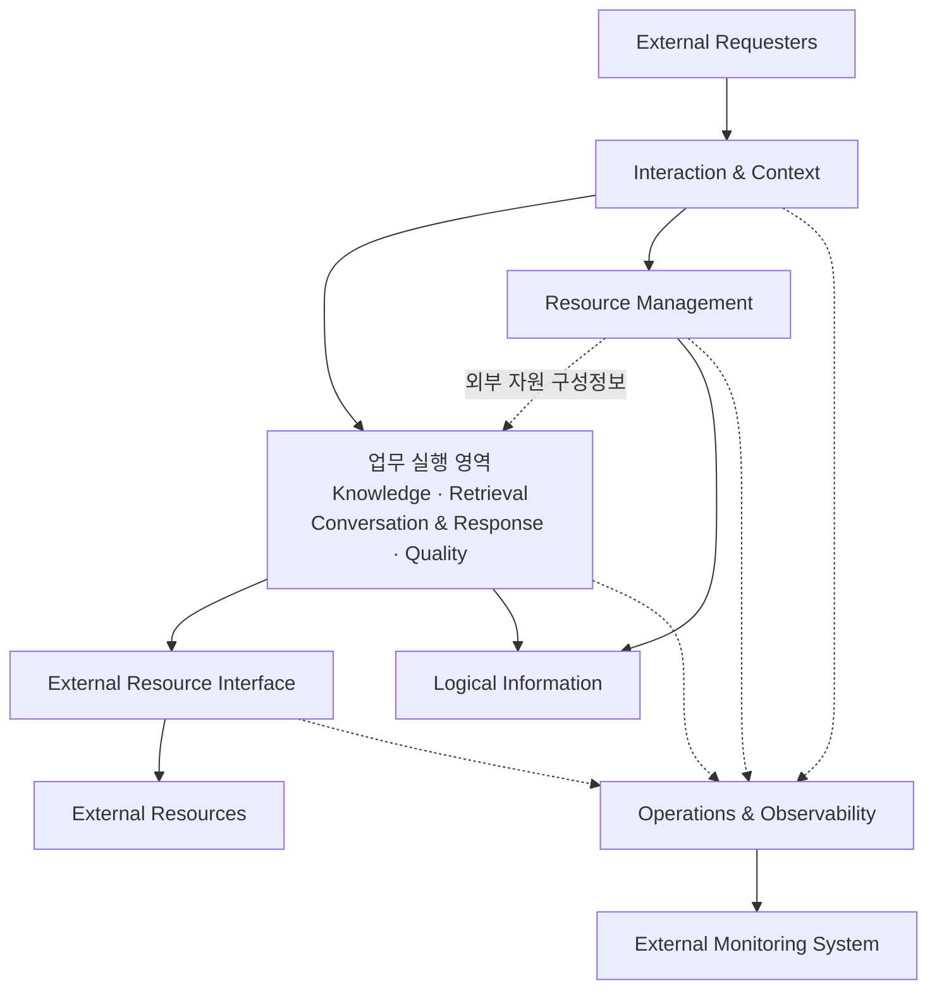

# Enterprise RAG Logical Architecture

## 1. 문서 목적

본 문서는 [Enterprise RAG Concept](./00_Concept.md)에서 정의한 시스템 목적, 책임, 원칙 및 경계를 논리적인 아키텍처 구조로 구체화한다.

Logical Architecture는 Enterprise RAG가 수행하는 책임을 논리 영역으로 분리하고, 각 영역의 책임과 상호작용 관계를 정의한다.

본 문서의 목적은 다음과 같다.

- Concept의 Capability를 논리 영역으로 구체화한다.
- 각 논리 영역의 책임과 경계를 명확하게 한다.
- 논리 영역 간 의존 관계와 정보 흐름을 정의한다.
- 주요 업무 흐름에서 각 논리 영역의 역할을 정의한다.
- 외부 시스템과 Enterprise RAG 사이의 논리적 접점을 정의한다.
- Tenant 격리, 근거 기반 답변, 품질 평가 및 관찰성 원칙의 적용 위치를 정의한다.
- 후속 상세 설계, API 설계 및 데이터 설계의 기준을 제공한다.

본 문서에서 정의하는 논리 영역은 특정 서비스, 프로세스, 애플리케이션, 컨테이너 또는 배포 단위를 의미하지 않는다.

논리 영역 내부의 구성요소와 구현 방식은 후속 설계 단계에서 정의한다.

---

## 2. 설계 범위

### 2.1 포함 범위

본 문서에서는 다음 내용을 정의한다.

- Enterprise RAG의 전체 논리 구조
- 논리 영역과 책임
- 논리 영역 간 의존 관계
- 논리 영역 간 정보 흐름
- 주요 업무 흐름의 책임 주체
- 외부 시스템과의 논리적 경계
- 외부 자원과의 논리적 인터페이스
- 공통 설계 원칙의 적용 위치
- Concept Capability와 논리 영역 간 매핑

### 2.2 제외 범위

본 문서에서는 다음 내용을 정의하지 않는다.

- 논리 영역 내부의 세부 구성요소
- 컴포넌트와 클래스 구조
- 세부 처리 알고리즘
- 처리 단계별 상태와 상태 전이
- 동기 및 비동기 처리 방식
- 오류 처리와 재시도 정책
- API 및 메시지 구조
- 데이터 엔티티와 속성
- 데이터베이스 및 저장소 구성
- 서비스 및 프로세스 분리
- 배포 및 네트워크 구조
- 구체적인 제품과 기술 선정
- 외부 자원별 통신 프로토콜
- OpenTelemetry의 세부 계측 항목과 전달 구성

---

## 3. 설계 관점

### 3.1 책임 영역 중심

Enterprise RAG는 시스템이 수행하는 책임을 기준으로 논리 영역을 구분한다.

논리 영역은 기술이나 배포 구조가 아니라, 독립적으로 설명할 수 있는 업무 책임의 경계를 의미한다.

### 3.2 Concept Capability의 구체화

Concept에서 정의한 다음 Capability를 Logical Architecture의 핵심 논리 영역으로 구체화한다.

1. 지식 관리
2. 지식 검색
3. 대화 및 답변
4. 외부 자원 관리 및 인터페이스
5. 품질 관리
6. 운영 및 관찰

요청 수용과 실행 컨텍스트, 논리 정보 관리는 핵심 Capability를 일관되게 지원하기 위한 논리 영역으로 정의한다.

Concept의 `외부 자원 관리 및 인터페이스` Capability는 시스템 공통 관리 책임인 `Resource Management`와 실행 시 외부 자원과 상호작용하는 `External Resource Interface`로 구체화한다.

### 3.3 책임 소유 영역에 의한 흐름 주도

각 업무 흐름은 해당 업무의 최종 결과를 책임지는 논리 영역이 주도한다.

```text
지식 구성
  → Knowledge 영역 주도

관련 지식 검색
  → Retrieval 영역 주도

질의응답
  → Conversation & Response 영역 주도

품질 평가
  → Quality 영역 주도
```

전체 업무를 중앙에서 판단하고 제어하는 범용 Orchestrator 영역은 별도로 정의하지 않는다.

각 논리 영역은 자신의 책임 범위 안에서 흐름을 주도하고, 필요한 책임을 다른 영역에 요청한다.

### 3.4 외부 자원 인터페이스 관점

Enterprise RAG는 모델, 검색 저장소, 프롬프트 및 평가 수단을 자체적으로 선택하거나 운영하지 않는다.

외부에서 결정된 자원과 상호작용하기 위한 논리적 접점을 제공한다.

이 접점은 외부 시스템의 세부 특성이 핵심 업무 영역에 직접 노출되지 않도록 하며, 핵심 영역이 외부 자원을 역할 중심으로 사용할 수 있도록 한다.

```text
핵심 업무 영역
  → 외부 자원 사용 요청
  → External Resource Interface
  → 지정된 외부 시스템
```

`Interface`는 논리적 접점과 책임 경계를 의미한다.

구체적인 API, Adapter, Gateway 또는 통신 방식은 본 단계에서 결정하지 않는다.

### 3.5 Concept 원칙의 참조

다음 원칙의 정의는 Enterprise RAG Concept를 따른다.

- 외부 결정, 내부 실행
- Tenant 중심 격리
- 지식 범위 제한
- 추적 가능한 결과
- 교체 가능한 외부 연계
- 측정 가능한 품질
- 평가와 운영 변경의 분리
- 외부 관찰 중심 모니터링

본 문서에서는 원칙을 다시 정의하지 않고, 원칙이 각 논리 영역과 관계에 적용되는 방식을 설명한다.

---

## 4. 전체 논리 구조

Enterprise RAG는 다음 논리 영역으로 구성한다.



4장의 다이어그램은 전체 책임 배치만 표현한다. `업무 실행 영역`은 Knowledge, Retrieval, Conversation & Response 및 Quality를 읽기 쉽게 묶어 표시한 것이며 새로운 논리 영역이나 단일 컴포넌트를 의미하지 않는다. 영역 내부 관계와 주요 처리 흐름은 6장과 7장에서 구체화한다.

Resource Management는 시스템 공통 외부 자원 구성정보를 관리하고 실행 영역에 적용할 구성정보를 제공하지만 외부 자원의 업무 호출을 수행하지 않는다. 외부 호출은 Knowledge, Retrieval, Conversation & Response 및 Quality가 External Resource Interface를 통해 수행한다.

Logical Information은 하나의 중앙 저장소를 의미하지 않는다. 각 논리 영역이 소유하거나 사용하는 정보의 논리적 범위와 관계를 나타낸다.

Operations & Observability는 모든 논리 영역에 공통으로 적용되며, OpenTelemetry 기반 관찰정보를 외부 모니터링 시스템에 제공한다.

---

## 5. 논리 영역

### 5.1 Interaction & Context

Interaction & Context는 외부 요청을 Enterprise RAG의 내부 실행 맥락으로 변환하는 논리 영역이다.

Tenant 업무 요청에는 Tenant와 사용자 컨텍스트를 적용한다. 시스템 공통 외부 자원 관리 요청은 Tenant 업무 요청과 구분하고 외부 운영 체계에서 검증된 관리 요청 맥락을 수용한다.

#### 주요 책임

- 외부 요청을 수용한다.
- 외부에서 검증된 사용자 및 Tenant 컨텍스트를 수용한다.
- 요청의 목적과 업무 유형을 식별한다.
- 대상 Knowledge Base와 지식 범위를 확인한다.
- 실행을 추적할 수 있는 공통 맥락을 구성한다.
- 업무 결과를 외부 응답으로 전달한다.

#### 책임 경계

Interaction & Context는 다음 책임을 수행하지 않는다.

- 사용자 인증
- 조직과 사용자 권한 관리
- 업무 문서의 지식화
- 관련 지식 검색
- 최종 답변 생성
- 품질 평가
- 외부 자원의 선택과 운영

### 5.2 Knowledge

Knowledge는 업무 문서를 검색 가능한 지식으로 구성하고 그 상태를 유지하는 논리 영역이다.

#### 주요 책임

- 업무 문서를 지식 구성 대상으로 수용한다.
- 최초 지식 생성 전에 후보 처리·질의·검색 전략의 비교를 선택적으로 제공한다.
- 후보별 결과에 대한 사용자 선택과 최종 확정을 유지한다.
- 원본 문서와 문서 변경 관계를 유지한다.
- 문서의 내용과 구조를 검색 가능한 지식으로 구성한다.
- 검색에 활용할 수 있는 지식 표현을 생성한다.
- 구성된 지식을 검색 가능한 상태로 반영한다.
- 문서 변경에 따라 기존 지식을 갱신하거나 제거한다.
- 원본 문서와 구성된 지식 간의 추적 관계를 유지한다.
- 지식 구성 결과의 상태를 관리한다.

지식 생성 전략 선택은 Knowledge 영역 안에서 지식 구성 및 게시와 구분되는 책임이다. 문서의 대표 범위로 준비한 후보별 임시 결과를 Retrieval과 Conversation & Response를 통해 비교하고, 사용자가 확정한 전략을 전체 지식 생성에 전달한다.

후보 결과는 운영 지식 게시 단위가 아니며, 선택 결과는 개별 문서가 아니라 Knowledge Base의 초기 지식 생성 범위에 적용한다.

#### 책임 경계

Knowledge는 다음 책임을 수행하지 않는다.

- 사용자 질문에 대한 관련 지식 검색
- 최종 답변 생성
- 외부 모델의 자동 선택
- 외부 검색 저장소의 제품 선정
- 외부 자원의 배포와 운영
- 문서 분석 모델의 생명주기 관리
- 후보 결과의 자동 품질 판정과 자동 전략 확정
- 외부 자원을 후보로 자동 선택하거나 Tenant별로 할당

### 5.3 Retrieval

Retrieval은 사용자 질문과 관련된 지식을 지정된 Tenant 및 Knowledge Base 범위 안에서 탐색하고 답변 근거로 구성하는 논리 영역이다.

#### 주요 책임

- 사용자 질문과 검색 목적을 해석한다.
- 검색 대상과 지식 범위를 구성한다.
- 질문에 관련된 지식을 탐색한다.
- 검색 결과의 범위와 유효성을 확인한다.
- 검색 결과의 관련성을 판단한다.
- 불필요하거나 중복된 결과를 정리한다.
- 답변 생성에 사용할 근거를 구성한다.
- 검색 결과가 질문에 답하기 충분한지 판단한다.
- 검색 실행과 검색 결과의 추적 관계를 유지한다.

#### 책임 경계

Retrieval은 다음 책임을 수행하지 않는다.

- 최종 사용자 답변 생성
- 대화 생명주기 관리
- 외부 생성 모델 호출 목적 결정
- 지식 원본의 변경
- 검색 저장소의 제품 또는 배포 구조 결정
- 검색 결과를 운영 설정에 자동 반영

### 5.4 Conversation & Response

Conversation & Response는 사용자 질문, 대화 맥락 및 검색된 근거를 결합하여 최종 답변과 출처를 제공하는 논리 영역이다.

#### 주요 책임

- 사용자와 Enterprise RAG 사이의 대화 맥락을 유지한다.
- 현재 질문에 필요한 관련 지식 검색을 Retrieval에 요청한다.
- 사용자 질문과 검색 근거를 결합한다.
- 외부에서 관리되는 프롬프트를 적용한다.
- 지정된 외부 생성 자원을 통해 답변을 생성한다.
- 검색 근거가 부족한 경우 제한된 응답을 제공한다.
- 답변과 원본 지식의 출처 관계를 구성한다.
- 질문, 검색 결과, 답변 및 출처의 관계를 유지한다.
- 최종 응답을 사용자 요청에 적합한 형태로 구성한다.

#### 책임 경계

Conversation & Response는 다음 책임을 수행하지 않는다.

- 검색 방법과 검색 알고리즘 결정
- 검색 결과의 관련성 판단 기준 관리
- 생성 모델의 자동 선택과 라우팅
- 프롬프트의 작성과 생명주기 관리
- 검색 근거가 없는 일반 지식 기반 답변
- 품질 평가 결과에 따른 자동 설정 변경

대화 이력은 질문의 맥락을 구성하는 데 활용할 수 있으나, 검색된 지식 근거를 대체하지 않는다.

대화는 Tenant 범위와 대화 소유 사용자 범위를 함께 적용한다. 사용자 식별정보는 자신의 대화 이력을 구분하기 위한 소유자 참조이며, Knowledge Base나 문서에 대한 사용자별 권한으로 사용하지 않는다.

### 5.5 Quality

Quality는 검색 결과와 생성 답변의 품질을 평가하고 개선 판단에 필요한 근거를 제공하는 논리 영역이다.

핵심 범위는 운영 또는 평가 실행에서 생성된 검색 결과와 응답을 평가하는 것이다. 서로 다른 외부 자원 구성의 비교 평가는 선택적 확장 범위로 둔다.

#### 주요 책임

- 검색 결과와 최종 답변에 대한 사용자 피드백을 수용한다.
- 피드백과 평가 대상 결과의 관계를 유지한다.
- 반복 가능한 품질 평가 기준을 관리한다.
- 검색 결과의 품질을 평가한다.
- 생성된 답변의 품질을 평가한다.
- 외부 평가 수단을 이용한 평가를 지원한다.
- 품질 변화와 개선 필요 영역을 식별한다.
- 평가 결과와 평가 당시의 실행 조건을 연결한다.
- 선택적으로 서로 다른 외부 자원 구성이 적용된 평가 결과를 비교한다.

#### 책임 경계

Quality는 다음 책임을 수행하지 않는다.

- 검색 또는 답변 설정의 자동 변경
- 운영 환경에 대한 자동 배포
- 평가 결과에 따른 외부 자원 자동 선택
- 평가 도구 자체의 개발과 운영
- 사용자 피드백의 무검증 자동 반영

RAGAS는 Quality가 활용할 수 있는 외부 평가 수단 중 하나이다.

Logical Architecture는 특정 평가 프레임워크에 종속되지 않는다.

### 5.6 Resource Management

Resource Management는 외부에서 결정된 자원의 참조정보와 적용 구성을 Enterprise RAG 전체에서 공통으로 관리하는 논리 영역이다.

#### 주요 책임

- 외부 자원 프로파일과 역할을 관리한다.
- 자원 간 호환성 정보를 유지한다.
- 실행 영역이 공통으로 사용할 외부 자원 구성을 관리한다.
- 구성 변경과 적용 관계를 추적할 수 있는 이력을 유지한다.
- 구성의 활성화, 비활성화 및 이전 구성으로의 복원을 지원한다.
- 실행 및 지식 게시 결과와 사용된 구성의 관계를 유지한다.

#### 적용 범위

외부 자원 관리정보는 Tenant별 데이터가 아닌 시스템 공통 구성정보이다.

모든 Tenant는 동일한 시스템 공통 구성 집합을 참조하며, Tenant별 자원 프로파일이나 할당을 두지 않는다. 구성 전환 기간에는 이전 구성과 새 구성이 공통 구성 이력 안에서 함께 유효할 수 있고, 지식 게시와 실행은 자신에게 적용된 외부 자원 구성정보로 호환성을 판단한다. Tenant 정보는 실행 또는 지식 게시 결과가 어느 Tenant에 속하는지를 추적하기 위해서만 결합된다.

실제 인증정보와 Secret 값은 외부 Secret 관리 체계가 소유하며, Resource Management는 그 참조만 관리한다.

#### 이력관리 범위

Resource Management는 실행 결과, 지식 게시 호환성 및 복원에 영향을 주는 외부 자원 구성의 변경과 적용 이력을 관리한다.

논리적 이력 범위는 다음과 같다.

- 외부 자원의 역할, 식별 참조 및 적용 관계 변경
- 지식 구성과 검색 호환성에 영향을 주는 정보 변경
- 외부 자원 구성의 적용, 적용 종료 및 복원 관계
- 지식 게시, 검색, 답변 및 평가 결과에 적용된 외부 자원 구성정보

Secret과 인증정보 원문의 변경 이력은 외부 Secret 관리 체계가 책임진다. 외부 자원의 일시적인 가용성, 지연과 오류는 Operations & Observability의 관찰정보로 다룬다. 설명과 표시정보처럼 실행 결과와 호환성에 영향을 주지 않는 변경은 필수 이력 범위에 포함하지 않는다.

Resource Management는 외부 자원의 현재 상태를 직접 조회하여 구성정보와 비교하거나, 불일치를 이유로 구성을 자동 비활성화하지 않는다. 적용 상태의 변경은 외부 운영 체계에서 검증된 명시적인 관리 요청에 따라 수행한다.

구성 변경의 저장 단위, 변경 전후 관계, 보존 기간 및 세부 상태는 후속 상세 설계와 데이터 설계에서 정의한다.

#### 책임 경계

Resource Management는 다음 책임을 수행하지 않는다.

- 외부 자원의 개발, 배포 및 운영
- 실행 요청별 외부 자원 자동 선택과 라우팅
- 외부 자원의 업무 호출 수행
- Tenant별 자원 구성 관리
- 지식 구성, 검색, 답변 생성 및 품질 평가
- 사용자 인증, 조직 및 역할 관리

### 5.7 External Resource Interface

External Resource Interface는 Enterprise RAG의 핵심 논리 영역과 외부 자원 사이의 논리적 접점이다.

핵심 논리 영역은 이 인터페이스를 통해 적용된 외부 자원 구성정보가 참조하는 모델, 검색 저장소, 프롬프트 및 평가 수단과 상호작용한다.

#### 주요 책임

- Resource Management에서 관리하는 공통 자원 구성을 확인한다.
- 핵심 논리 영역이 외부 자원을 역할 중심으로 사용할 수 있도록 한다.
- 외부 시스템별 요청과 응답 차이를 핵심 업무 영역으로부터 분리한다.
- 적용된 외부 자원 구성정보를 기준으로 외부 자원에 요청을 전달하고 결과를 내부 논리 영역에 반환한다.
- 외부 자원 호출의 실행 컨텍스트와 추적정보를 유지한다.
- 외부 자원의 오류와 제한 결과를 내부에서 해석 가능한 형태로 전달한다.
- 실행 결과와 적용된 외부 자원 구성정보의 관계를 유지한다.

#### 인터페이스 대상

##### 문서 해석 자원

업무 문서의 내용과 구조를 해석하기 위한 외부 자원과 상호작용한다.

##### 임베딩 자원

문서 지식과 사용자 질문을 검색 가능한 표현으로 변환하기 위한 외부 자원과 상호작용한다.

##### 생성 자원

검색된 근거를 바탕으로 사용자 답변을 생성하기 위한 외부 자원과 상호작용한다.

##### 지식 검색 저장소

지식 표현을 반영하고 관련 지식을 검색하기 위한 외부 저장소와 상호작용한다.

##### 프롬프트 관리 시스템

외부에서 작성되고 관리되는 프롬프트를 사용하기 위한 논리적 접점을 제공한다.

##### 외부 평가 수단

검색 결과와 답변 품질을 평가하는 외부 평가 시스템 또는 프레임워크와 상호작용한다.

#### 책임 경계

External Resource Interface는 다음 책임을 수행하지 않는다.

- 외부 자원의 자동 선택
- 여러 모델 사이의 자동 라우팅
- 모델 성능에 따른 자동 전환
- 외부 자원의 부하 분산 정책 결정
- 외부 모델의 배포 및 운영
- 검색 저장소의 설치와 운영
- 프롬프트의 작성과 승인
- 외부 평가 도구의 생명주기 관리
- 핵심 업무 흐름의 중앙 조정

### 5.8 Operations & Observability

Operations & Observability는 Enterprise RAG의 업무 실행 상태를 추적하고 외부 운영 체계에서 관찰할 수 있는 정보를 제공하는 논리 영역이다.

#### 주요 책임

- 지식 처리 실행 상태를 추적한다.
- 검색 및 답변 실행 상태를 추적한다.
- 품질 평가 실행 상태를 추적한다.
- 실패하거나 중단된 실행을 식별한다.
- 재처리가 필요한 업무 대상을 식별한다.
- 업무 실행과 처리 결과의 관계를 유지한다.
- 문제 분석에 필요한 실행정보를 제공한다.
- 각 논리 영역에서 생성되는 관찰정보를 실행 맥락에 따라 연결한다.
- OpenTelemetry 기반의 표준 관찰정보를 외부 모니터링 시스템에 제공한다.
- 외부 자원 호출을 전체 실행 흐름과 연결하여 관찰할 수 있도록 한다.

#### 관찰 대상

- 지식 구성 실행
- 지식 검색 실행
- 답변 생성 실행
- 품질 평가 실행
- 외부 자원 호출
- 처리 시간과 지연
- 오류와 실패
- Tenant별 실행 범위
- 검색 결과와 답변 품질 상태

#### 책임 경계

Operations & Observability는 다음 책임을 수행하지 않는다.

- 관찰정보의 장기 저장
- 모니터링 대시보드 제공
- 관찰정보의 분석과 시각화
- 이상 상태 탐지
- 경보 및 알림 정책 관리
- 외부 모니터링 제품의 운영
- 품질 또는 운영 상태에 따른 업무 설정 자동 변경

관찰정보의 수집 이후 저장, 분석, 시각화 및 경보는 외부 모니터링 시스템이 담당한다.

### 5.9 Logical Information

Logical Information은 Enterprise RAG가 관리하는 정보의 논리적 범위와 관계를 나타낸다.

이는 특정 데이터베이스, 저장소, 스키마 또는 테이블 구조를 의미하지 않는다.

#### 문서 정보

- 원본 문서
- 문서 변경 및 버전 관계
- 문서 처리 상태
- 문서와 Tenant의 관계
- 문서와 Knowledge Base의 관계

#### 지식 정보

- 검색에 활용되는 지식
- 검색 가능한 지식 표현
- 원본 문서와 지식의 관계
- 지식의 원본 위치
- 지식의 검색 가능 상태
- 지식과 적용된 외부 자원 구성정보의 관계
- 후보 지식 생성 전략
- 후보별 임시 비교 범위와 결과
- 사용자 후보 선택과 최종 확정
- 선택된 지식 생성 전략과 최종 지식 게시의 관계

#### 대화 및 응답 정보

- 대화
- 사용자 질문
- 대화 맥락
- 검색 결과
- 답변 근거
- 생성 답변
- 출처정보
- 질문과 답변의 관계

#### 품질 정보

- 사용자 피드백
- 평가 기준
- 평가 실행
- 평가 결과
- 선택적 자원 구성 비교 결과
- 개선 필요 영역

#### 실행 정보

- 실행 컨텍스트
- 실행 식별정보
- 실행 상태
- 오류와 실패
- 재처리 관계
- 외부 자원 호출 관계
- 추적정보

#### 외부 자원 구성정보

- 외부 자원의 식별 참조
- 외부 자원의 역할
- 외부 자원 간 호환성
- 시스템 공통 적용 구성
- 구성 변경과 활성 상태
- 지식 게시에 사용된 구성
- 실행에 적용된 외부 자원 구성정보
- 처리 결과와 외부 자원 구성정보의 관계

외부 자원 관리정보는 Tenant 소유 정보와 분리된 시스템 공통 정보이다. 실제 인증정보와 Secret은 외부 관리 체계에 두며 Enterprise RAG는 참조관계만 유지한다.

#### 지식 게시 정보

- 동일한 구성 기준으로 생성된 지식 게시 단위
- 게시 단위와 Tenant 및 Knowledge Base의 관계
- 게시 단위와 외부 자원 구성의 관계
- 게시 단위의 활성 및 비활성 상태
- 이전 게시 단위와 새 게시 단위의 전환 관계

---

## 6. 논리 영역 간 관계

논리 영역 간 기본 의존 관계는 다음과 같다.

```text
Interaction & Context
          │
          ├──────────────→ Knowledge
          │
          ├──────────────→ Conversation & Response
          │
          ├──────────────→ Quality
          │
          └──────────────→ Operations & Observability

Conversation & Response
          │
          └──────────────→ Retrieval

Knowledge의 지식 생성 전략 선택 책임
          │
          ├──────────────→ Retrieval
          └──────────────→ Conversation & Response

Knowledge
          │
          └──────────────→ External Resource Interface

Retrieval
          │
          └──────────────→ External Resource Interface

Conversation & Response
          │
          └──────────────→ External Resource Interface

Quality
          │
          └──────────────→ External Resource Interface

Resource Management
          │
          └──────────────→ Logical Information

Knowledge · Retrieval · Conversation & Response · Quality
          │
          └──────────────→ Logical Information

모든 논리 영역
          │
          └──────────────→ Operations & Observability
```

위 관계는 다른 영역의 책임을 이용하는 의존 방향을 나타낸다. 요청과 결과가 이동하는 시간적 순서는 7장의 주요 논리 흐름에서 별도로 정의한다.

### 6.1 Interaction & Context와 핵심 영역

Interaction & Context는 외부 요청을 해당 업무 책임 영역에 전달한다.

- 문서와 지식 관련 요청은 Knowledge에 전달한다.
- 질의응답 요청은 Conversation & Response에 전달한다.
- 피드백과 평가 요청은 Quality에 전달한다.
- 실행 상태 조회는 Operations & Observability와 관계된다.

Interaction & Context는 업무 영역의 내부 판단을 대신하지 않는다.

### 6.2 Knowledge와 Retrieval

Knowledge는 검색 가능한 지식을 구성하고 유지한다.

Retrieval은 Knowledge가 구성한 지식을 대상으로 관련 지식을 탐색한다.

Retrieval은 지식의 원본이나 생명주기를 변경하지 않는다.

Knowledge는 특정 사용자 질문의 검색 결과를 결정하지 않는다.

다만 지식 생성 전략 선택에서는 Knowledge가 비교 목적과 후보별 임시 범위를 제공하고 Retrieval에 후보별 검색 결과를 요청한다. Retrieval은 후보 전략을 선택하지 않으며 각 후보에 지정된 범위와 방법으로 검색 결과를 제공한다.

Conversation & Response는 비교 목적의 질문에 대해 후보별 답변과 출처를 제공하지만 사용자의 선택이나 최종 전략을 결정하지 않는다.

### 6.3 Retrieval과 Conversation & Response

Conversation & Response는 사용자 질문에 필요한 지식 검색을 Retrieval에 요청한다.

Retrieval은 검색된 지식과 답변 근거를 제공한다.

Conversation & Response는 Retrieval이 제공한 근거 범위 안에서 최종 답변을 구성한다.

Conversation & Response는 Retrieval의 검색 방법을 직접 결정하지 않는다.

### 6.4 Quality와 핵심 업무 영역

Quality는 운영 또는 평가 실행에서 생성된 Retrieval의 검색 결과와 Conversation & Response의 응답을 평가 대상으로 사용할 수 있다.

Quality는 검색 결과와 응답을 평가하지만, 해당 영역의 내부 처리 방식이나 운영 설정을 직접 변경하지 않는다.

### 6.5 Resource Management와 실행 영역

Resource Management는 외부 자원의 시스템 공통 구성 집합과 호환성 기준을 관리한다.

Knowledge, Retrieval, Conversation & Response 및 Quality는 지식 게시 또는 실행에 적용되는 공통 구성의 일관된 시점을 사용한다.

Resource Management는 업무 실행과 외부 자원 호출을 수행하지 않으며, 실행 영역은 공통 구성을 임의로 변경하거나 Tenant별로 재정의하지 않는다.

### 6.6 핵심 영역과 External Resource Interface

핵심 논리 영역은 외부 모델, 검색 저장소, 프롬프트 및 평가 수단과 직접 결합되지 않는다.

외부 자원과의 상호작용은 External Resource Interface를 통해 수행한다.

이를 통해 핵심 업무 책임과 외부 시스템의 기술적 특성을 분리한다.

```text
Knowledge
  → External Resource Interface
  → 문서 해석·임베딩·검색 저장소

Retrieval
  → External Resource Interface
  → 임베딩·검색 저장소

Conversation & Response
  → External Resource Interface
  → 프롬프트·생성 자원

Quality
  → External Resource Interface
  → 외부 평가 수단
```

### 6.7 핵심 영역과 Operations & Observability

모든 핵심 논리 영역은 실행 상태와 관찰정보를 제공한다.

Operations & Observability는 각 영역에서 발생한 정보를 공통 실행 맥락에 따라 연결한다.

Operations & Observability는 업무 영역의 처리 결정을 대신하지 않는다.

---

## 7. 주요 논리 흐름

주요 흐름은 논리 영역 간 책임 이동과 정보 흐름을 표현한다.

논리 영역 내부의 세부 처리 절차와 구성요소 호출 순서는 본 문서에서 정의하지 않는다.

### 7.1 지식 구성 흐름

```text
외부 요청자
  → Interaction & Context
  → Knowledge
  → External Resource Interface
  → 외부 문서 해석·임베딩·검색 저장소
  → Knowledge
  → Logical Information
  → Operations & Observability
  → 처리 결과 반환
```

#### 영역별 책임

- Interaction & Context는 Tenant와 요청 범위를 포함한 실행 맥락을 구성한다.
- Knowledge는 업무 문서를 검색 가능한 지식으로 구성하는 흐름을 주도한다.
- Resource Management는 지식 구성에 적용되는 공통 외부 자원 구성과 호환성 기준을 제공한다.
- External Resource Interface는 지정된 외부 문서 해석, 임베딩 및 검색 저장소와의 상호작용을 제공한다.
- Logical Information은 원본 문서와 구성된 지식의 관계를 유지한다.
- Operations & Observability는 실행 상태와 OpenTelemetry 관찰정보를 제공한다.

### 7.2 지식 생성 전략 선택 흐름

```text
외부 요청자
  → Interaction & Context
  → Knowledge의 지식 생성 전략 선택
  → 후보별 임시 비교 범위 준비
  → Retrieval 및 Conversation & Response
  → 후보별 검색·답변·출처 제공
  → 사용자 비교·선택 및 최종 확정
  → Knowledge가 선택된 전략으로 전체 지식 구성
  → 최종 지식 게시
  → 임시 비교 결과 정리
```

- 선택 기능은 최초 지식 생성 전에 선택적으로 수행한다.
- 임시 비교 범위는 Tenant와 Knowledge Base 및 후보별로 격리하고 운영 검색에 노출하지 않는다.
- 사용자 선택은 품질 피드백과 구분하며 Quality가 전략을 자동 결정하지 않는다.
- 하나의 선택 과정에는 동일한 시스템 공통 외부 자원 구성정보를 적용한다.
- 최종 게시 지식은 임시 결과를 승격하지 않고 선택된 전략으로 전체 문서를 처리하여 생성한다.

### 7.3 검색 및 답변 흐름

```text
외부 요청자
  → Interaction & Context
  → Conversation & Response
  → Retrieval
  → External Resource Interface
  → 외부 임베딩 자원·검색 저장소
  → Retrieval
  → Conversation & Response
  → External Resource Interface
  → 외부 프롬프트·생성 자원
  → Conversation & Response
  → Logical Information
  → Operations & Observability
  → 답변과 출처 반환
```

#### 영역별 책임

- Interaction & Context는 질문, Tenant 및 검색 범위를 포함한 실행 맥락을 구성한다.
- Conversation & Response는 전체 질의응답 흐름을 주도한다.
- Retrieval은 관련 지식을 검색하고 답변 근거를 구성한다.
- Resource Management는 검색과 답변에 적용되는 공통 외부 자원 구성의 일관된 시점을 제공한다.
- External Resource Interface는 지정된 임베딩, 검색 저장소, 프롬프트 및 생성 자원과의 상호작용을 제공한다.
- Conversation & Response는 검색된 근거 범위 안에서 답변과 출처를 구성한다.
- Retrieval은 실행에 적용된 외부 자원 구성정보와 호환되며 활성화된 지식 게시 단위만 검색한다.
- 하나의 검색 범위에 서로 호환되지 않는 임베딩 구성이 적용된 게시 단위가 포함되면 검색을 수행하지 않는다.
- Logical Information은 질문, 검색 결과, 답변 및 출처 관계를 유지한다.

### 7.4 사용자 피드백 흐름

```text
외부 요청자
  → Interaction & Context
  → Quality
  → Logical Information
  → Operations & Observability
  → 처리 결과 반환
```

#### 영역별 책임

- Interaction & Context는 피드백 대상의 Tenant와 대화 소유자를 확인한다.
- Quality는 피드백을 수용하고 평가 대상 결과와 연결한다.
- Logical Information은 피드백과 질문, 검색 결과 또는 답변의 관계를 유지한다.
- Operations & Observability는 피드백 처리 상태를 관찰할 수 있도록 한다.

### 7.5 품질 평가 흐름

```text
평가 실행 주체
  → Interaction & Context
  → Quality
  → Retrieval 및 Conversation & Response 결과 참조
  → External Resource Interface
  → 외부 평가 수단
  → Quality
  → Logical Information
  → Operations & Observability
  → 평가 결과 반환
```

#### 영역별 책임

- Quality는 평가 흐름을 주도한다.
- Retrieval과 Conversation & Response의 결과를 평가 대상으로 사용한다.
- External Resource Interface는 RAGAS와 같은 외부 평가 수단과의 상호작용을 제공한다.
- Quality는 검색 결과와 응답에 대한 평가 결과를 구성한다.
- 적용 외부 자원 구성에 따른 평가 결과 비교는 선택적 확장으로 수행한다.
- 평가 결과는 운영 설정을 자동으로 변경하지 않는다.

### 7.6 운영 관찰 흐름

```text
각 논리 영역
  → 실행 상태와 관찰정보 생성
  → Operations & Observability
  → OpenTelemetry 기반 관찰정보 제공
  → 외부 모니터링 시스템
  → 저장·분석·시각화·이상 탐지·경보
```

Enterprise RAG는 OpenTelemetry 기반 관찰정보를 제공하는 범위까지 책임진다.

관찰정보의 수집 이후 저장과 활용은 외부 모니터링 시스템이 담당한다.

### 7.7 외부 자원 구성 변경과 지식 재게시 흐름

```text
Resource Management
  → 공통 외부 자원 구성 변경
  → Knowledge
  → Tenant·Knowledge Base별 새 지식 게시 단위 준비
  → 구성 호환성 확인
  → 새 게시 단위 활성화
  → 필요 시 이전 게시 단위 복원
```

Resource Management는 공통 외부 자원 구성과 호환성 기준을 책임진다.

Knowledge는 Tenant와 Knowledge Base별 재구성, 게시 단위의 활성화와 비활성화 및 복원을 책임진다.

기존 게시 단위는 새 게시 단위가 사용할 수 있는 상태가 되기 전까지 유지한다. 전환 기간의 지식 게시와 실행은 각 게시 단위가 참조한 외부 자원 구성정보로 호환성을 판단하며, Retrieval은 활성화된 호환 게시 단위만 사용한다. 하나의 검색 범위에는 서로 호환되지 않는 임베딩 구성이 적용된 게시 단위를 혼합하지 않는다.

---

## 8. 공통 원칙의 논리적 적용

| Concept 원칙 | Logical Architecture 적용 |
|---|---|
| 외부 결정, 내부 실행 | Resource Management는 외부에서 결정된 자원의 공통 관리정보를 유지하고, External Resource Interface는 해당 자원과의 상호작용만 제공한다. |
| Tenant 중심 격리 | Tenant 업무정보와 실행에는 Tenant 컨텍스트를 공통 적용하고, 대화는 사용자 소유자 범위를 추가 적용한다. 외부 자원 관리정보는 시스템 공통 범위로 분리한다. |
| 지식 범위 제한 | Retrieval이 구성한 근거 범위가 Conversation & Response의 답변 가능 범위를 결정한다. |
| 추적 가능한 결과 | 문서, 지식, 검색 결과, 답변, 출처, 피드백 및 평가 결과의 관계를 Logical Information에서 유지한다. |
| 교체 가능한 외부 연계 | 핵심 업무 영역과 외부 시스템 사이에 External Resource Interface를 둔다. |
| 측정 가능한 품질 | Quality가 사용자 피드백, 평가 기준과 검색 결과·응답의 평가를 책임진다. 자원 구성 비교는 선택적 확장으로 둔다. |
| 평가와 운영 변경 분리 | Quality는 평가 결과를 제공하지만 검색이나 답변 조건을 자동 변경하지 않는다. |
| 외부 관찰 중심 모니터링 | Operations & Observability가 OpenTelemetry 기반 관찰정보를 외부 모니터링 시스템에 제공한다. |

---

## 9. 외부 시스템 인터페이스

| 외부 시스템 | Enterprise RAG 접점 | 논리적 상호작용 |
|---|---|---|
| 사용자 및 업무 시스템 | Interaction & Context | 검증된 사용자·Tenant 컨텍스트와 업무 요청을 수용한다. |
| 인증 및 조직 관리 시스템 | Interaction & Context | 외부에서 검증된 인증 및 조직 맥락을 전달받는다. |
| 문서 해석 시스템 | External Resource Interface | 지정된 문서 해석 자원에 처리 요청을 전달하고 결과를 수용한다. |
| 임베딩 모델 제공 시스템 | External Resource Interface | 문서 지식과 질문의 검색 표현 생성을 요청한다. |
| 생성 모델 제공 시스템 | External Resource Interface | 검색된 근거를 바탕으로 답변 생성을 요청한다. |
| 지식 검색 저장소 | External Resource Interface | 지식 표현을 반영하고 관련 지식을 검색한다. |
| 프롬프트 관리 시스템 | External Resource Interface | 외부에서 관리되는 프롬프트를 조회하고 사용한다. |
| 외부 평가 시스템 | External Resource Interface | 검색 및 답변 품질 평가를 요청하고 결과를 수용한다. |
| 외부 모니터링 시스템 | Operations & Observability | OpenTelemetry 기반 관찰정보를 전달한다. |

외부 시스템의 개발, 배포, 운영 및 생명주기는 Enterprise RAG의 책임 범위에 포함하지 않는다.

---

## 10. Concept Capability 매핑

| Concept Capability | Logical Architecture 영역 | 구체화된 책임 |
|---|---|---|
| 지식 관리 | Knowledge | 초기 지식 생성 전략을 선택적으로 비교·확정하고 업무 문서를 검색 가능한 지식으로 구성·유지한다. |
| 지식 검색 | Retrieval | 질문과 관련된 지식을 탐색하고 답변 근거를 구성한다. |
| 대화 및 답변 | Conversation & Response | 검색 근거 범위 안에서 답변과 출처를 제공한다. |
| 외부 자원 관리 및 인터페이스 | Resource Management, External Resource Interface | 외부 자원의 시스템 공통 구성을 관리하고 외부 자원과의 논리적 접점을 제공한다. |
| 품질 관리 | Quality | 사용자 피드백과 검색 결과·응답 평가를 수행하며 자원 구성 비교는 선택적으로 확장한다. |
| 운영 및 관찰 | Operations & Observability | 실행 상태를 추적하고 OpenTelemetry 관찰정보를 제공한다. |
| Tenant 중심 격리 | Interaction & Context 및 공통 적용 | 검증된 Tenant 컨텍스트를 수용하고 모든 영역에 적용한다. |
| 추적 가능한 결과 | Logical Information | 문서에서 평가 결과까지 논리적 관계를 유지한다. |

Interaction & Context와 Logical Information은 새로운 업무 Capability가 아니다.

기존 Capability가 공통 실행 맥락과 정보 관계를 공유할 수 있도록 지원하는 논리 영역이다.

---

## 11. 논리적 의존 원칙

### 11.1 외부 자원 직접 의존 제한

Knowledge, Retrieval, Conversation & Response 및 Quality는 외부 시스템의 구체적인 호출 방식에 직접 의존하지 않는다.

외부 시스템과의 상호작용은 External Resource Interface를 통해 수행한다.

### 11.2 영역별 책임 소유

각 논리 영역은 자신이 생성하는 핵심 결과의 의미와 생명주기를 책임진다.

- Knowledge는 문서와 지식 상태를 책임진다.
- Retrieval은 검색 결과와 답변 근거를 책임진다.
- Conversation & Response는 대화와 최종 응답을 책임진다.
- Quality는 피드백과 평가 결과를 책임진다.
- Resource Management는 시스템 공통 외부 자원 구성과 구성 이력을 책임진다.
- Operations & Observability는 실행 상태와 관찰정보 제공을 책임진다.

### 11.3 다른 영역의 내부 판단 침범 제한

하나의 논리 영역은 다른 영역의 내부 처리 방식을 직접 결정하지 않는다.

예를 들어 다음 원칙을 따른다.

- Conversation & Response는 Retrieval의 검색 알고리즘을 결정하지 않는다.
- Retrieval은 답변의 표현 형식을 결정하지 않는다.
- Quality는 검색과 답변 조건을 자동 변경하지 않는다.
- Resource Management는 외부 자원을 자동 선택하거나 Tenant별로 다르게 할당하지 않는다.
- Operations & Observability는 업무 실행 결정을 대신하지 않는다.
- External Resource Interface는 외부 자원을 자동 선택하지 않는다.

### 11.4 실행 컨텍스트 유지

Tenant 업무를 처리하는 논리 영역 간 상호작용에는 다음 실행 맥락이 일관되게 유지되어야 한다.

- Tenant
- 실행 식별정보
- 요청 목적
- Knowledge Base와 지식 범위
- 적용된 외부 자원 구성정보
- 추적정보

구체적인 전달 구조는 API 설계 단계에서 정의한다.

시스템 공통 외부 자원 관리 요청은 Tenant 업무 요청과 구분하며, 접근 통제는 외부 운영 및 인증 경계가 담당한다.

---

## 12. 최종 논리 구조

최종 논리 구조와 영역 간 관계는 4장의 전체 논리 구조 다이어그램을 따른다.

핵심적인 책임 분리는 다음과 같다.

- Interaction & Context는 외부 요청을 책임 영역에 연결한다.
- Knowledge, Retrieval, Conversation & Response 및 Quality는 각자의 업무 결과를 책임진다.
- Resource Management는 시스템 공통 외부 자원 구성정보와 그 적용 이력을 관리하지만 외부 자원을 호출하지 않는다.
- External Resource Interface는 적용된 외부 자원 구성정보에 따라 실행 영역과 외부 자원의 논리적 접점을 제공한다.
- Logical Information은 각 영역이 관리하는 정보 범위와 관계를 나타내며 중앙 저장소를 의미하지 않는다.
- Operations & Observability는 모든 논리 영역의 관찰정보를 OpenTelemetry 기반으로 외부 모니터링 시스템에 제공한다.

본 Logical Architecture는 Enterprise RAG Concept의 Capability와 원칙을 논리적인 책임 영역과 상호작용 관계로 구체화한 것이다.

외부 시스템과의 관계는 `Integration`이 아닌 `Interface` 관점으로 정의한다.

External Resource Interface는 외부 자원을 통합하거나 관리하는 영역이 아니라, Resource Management에서 관리하는 공통 구성에 따라 Enterprise RAG의 핵심 논리 영역이 외부 자원과 상호작용하기 위한 논리적 접점이다.

논리 영역 내부의 구성요소, 구체적인 인터페이스 명세 및 구현 방식은 후속 상세 설계에서 정의한다.

후속 설계 과제와 작업 이력은 [WORK_STATUS](../WORK_STATUS.md)에서 관리한다.
